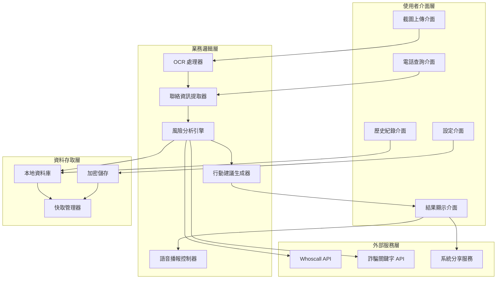

# Design Document: 長輩防詐助手

## Overview

長輩防詐助手是一個專為長輩與高風險族群設計的行動應用程式，旨在提供「少步驟、低門檻、快回覆」的防詐騙保護。系統整合 OCR 文字辨識、電話號碼資料庫查詢、AI 詐騙模式分析等技術，在 3 秒內提供風險評估與行動建議。

### 核心設計原則

1. **簡單優先**：最多 3 步完成查詢，避免複雜操作
2. **快速回應**：3 秒內完成分析並顯示結果
3. **清晰呈現**：大字體、高對比、紅黃綠燈視覺化
4. **多重輸出**：視覺 + 語音雙重呈現
5. **隱私保護**：本地處理優先，最小化資料上傳

### 技術棧選擇

- **前端框架**：React Native（跨平台支援 iOS/Android）
- **OCR 引擎**：Google ML Kit Text Recognition（本地處理）
- **語音合成**：系統內建 TTS（Text-to-Speech）
- **資料庫**：SQLite（本地儲存）+ Realm（加密支援）
- **網路請求**：Axios（HTTPS）
- **狀態管理**：Redux Toolkit
- **UI 組件**：React Native Paper（Material Design）

## Architecture

### 系統架構圖



### 資料流程

1. **截圖上傳流程**：
   - 使用者上傳截圖 → OCR 處理器提取文字 → 聯絡資訊提取器識別號碼/網址 → 風險分析引擎評估 → 結果顯示

2. **電話查詢流程**：
   - 使用者輸入號碼 → 聯絡資訊提取器標準化格式 → 風險分析引擎查詢資料庫 → 結果顯示

3. **風險分析流程**：
   - 輸入文字/號碼 → 本地關鍵字比對 → 外部 API 查詢 → AI 模式分析 → 計算風險分數 → 轉換為風險等級

## Components and Interfaces

### 1. OCR 處理器 (OCRProcessor)

**職責**：從截圖中提取文字內容

**介面**：
```typescript
interface OCRProcessor {
  // 處理截圖並提取文字
  processImage(imageUri: string): Promise<OCRResult>
  
  // 驗證圖片品質
  validateImageQuality(imageUri: string): ImageQualityStatus
}

interface OCRResult {
  text: string              // 提取的完整文字
  confidence: number        // 辨識信心度 (0-1)
  blocks: TextBlock[]       // 文字區塊
  processingTime: number    // 處理時間（毫秒）
}

interface TextBlock {
  text: string
  boundingBox: Rectangle
  confidence: number
}

enum ImageQualityStatus {
  GOOD = "good",
  BLURRY = "blurry",
  TOO_DARK = "too_dark",
  TOO_SMALL = "too_small"
}
```

**實作細節**：
- 使用 Google ML Kit Text Recognition API
- 在裝置本地執行，不上傳圖片至伺服器
- 支援繁體中文、簡體中文、英文混合辨識
- 圖片品質檢查：模糊度、亮度、解析度

### 2. 聯絡資訊提取器 (ContactExtractor)

**職責**：從文字中識別並提取電話號碼、網址、帳號等聯絡資訊

**介面**：
```typescript
interface ContactExtractor {
  // 提取所有聯絡資訊
  extractContacts(text: string): ContactInfo[]
  
  // 標準化電話號碼格式
  normalizePhoneNumber(phone: string): string
  
  // 驗證聯絡資訊有效性
  validateContact(contact: ContactInfo): boolean
}

interface ContactInfo {
  type: ContactType
  value: string           // 原始值
  normalized: string      // 標準化後的值
  position: number        // 在文字中的位置
}

enum ContactType {
  PHONE = "phone",
  URL = "url",
  EMAIL = "email",
  LINE_ID = "line_id",
  BANK_ACCOUNT = "bank_account"
}
```

**實作細節**：
- 使用正則表達式識別各類聯絡資訊
- 電話號碼支援格式：
  - 台灣市話：02-1234-5678, (02)1234-5678
  - 台灣手機：0912-345-678, 0912345678
  - 國際電話：+886-2-1234-5678
- 網址識別：http://, https://, 短網址
- 銀行帳號識別：3-6 位銀行代碼 + 帳號

### 3. 風險分析引擎 (RiskAnalyzer)

**職責**：綜合分析訊息內容與聯絡資訊，計算詐騙風險

**介面**：
```typescript
interface RiskAnalyzer {
  // 分析文字內容風險
  analyzeText(text: string): Promise<TextRiskAnalysis>
  
  // 查詢電話號碼風險
  analyzePhone(phone: string): Promise<PhoneRiskAnalysis>
  
  // 綜合計算最終風險
  calculateFinalRisk(analyses: Analysis[]): RiskAssessment
}

interface TextRiskAnalysis {
  score: number                    // 風險分數 (0-100)
  detectedPatterns: ScamPattern[]  // 偵測到的詐騙模式
  keywords: string[]               // 觸發的關鍵字
  analysisTime: number
}

interface PhoneRiskAnalysis {
  score: number
  reportCount: number              // 被標記次數
  reportTypes: string[]            // 標記類型
  lastReportDate: Date | null
  isKnownScam: boolean
}

interface ScamPattern {
  type: PatternType
  confidence: number               // 信心度 (0-1)
  matchedText: string             // 匹配的文字片段
  weight: number                  // 權重
}

enum PatternType {
  TIME_PRESSURE = "time_pressure",      // 時間壓力
  MONEY_REQUEST = "money_request",      // 金錢要求
  THREAT = "threat",                    // 恐嚇威脅
  LURE = "lure",                        // 利誘
  IMPERSONATION = "impersonation",      // 假冒官方
  URGENCY = "urgency"                   // 緊急性
}

interface RiskAssessment {
  level: RiskLevel                 // 風險等級
  score: number                    // 最終分數 (0-100)
  reasons: string[]                // 判定原因
  confidence: number               // 整體信心度
}

enum RiskLevel {
  SAFE = "safe",           // 綠燈：0-30 分
  SUSPICIOUS = "suspicious", // 黃燈：31-60 分
  DANGEROUS = "dangerous"    // 紅燈：61-100 分
}
```

**風險計算邏輯**：

```
基礎分數 = 0

// 文字內容分析
for each 偵測到的詐騙模式:
  基礎分數 += 模式權重 × 信心度

// 電話號碼分析
if 電話在黑名單:
  基礎分數 += 40
else if 被標記次數 > 10:
  基礎分數 += 30
else if 被標記次數 > 5:
  基礎分數 += 20

// 聯絡資訊異常
if 包含多個不同電話號碼:
  基礎分數 += 15
if 包含短網址:
  基礎分數 += 10

// 標準化到 0-100
最終分數 = min(基礎分數, 100)

// 轉換為風險等級
if 最終分數 >= 61: 紅燈
else if 最終分數 >= 31: 黃燈
else: 綠燈
```

**詐騙模式權重表**：
- 時間壓力 (TIME_PRESSURE): 15 分
- 金錢要求 (MONEY_REQUEST): 25 分
- 恐嚇威脅 (THREAT): 30 分
- 利誘 (LURE): 20 分
- 假冒官方 (IMPERSONATION): 25 分
- 緊急性 (URGENCY): 15 分

### 4. 關鍵字偵測器 (KeywordDetector)

**職責**：偵測文字中的詐騙關鍵字

**介面**：
```typescript
interface KeywordDetector {
  // 偵測關鍵字
  detectKeywords(text: string): DetectedKeyword[]
  
  // 更新本地關鍵字資料庫
  updateLocalDatabase(): Promise<void>
  
  // 取得資料庫版本
  getDatabaseVersion(): string
}

interface DetectedKeyword {
  keyword: string
  category: PatternType
  position: number
  context: string          // 前後文
}
```

**關鍵字資料庫結構**：
```typescript
interface KeywordDatabase {
  version: string
  lastUpdate: Date
  categories: {
    [key in PatternType]: string[]
  }
}

// 範例資料
const keywordDatabase: KeywordDatabase = {
  version: "1.0.0",
  lastUpdate: new Date("2025-01-01"),
  categories: {
    time_pressure: ["立即", "馬上", "今天內", "3日內", "限時", "即將"],
    money_request: ["匯款", "轉帳", "繳費", "稅金", "手續費", "保證金"],
    threat: ["停用", "凍結", "法院", "拘票", "逮捕", "罰款"],
    lure: ["中獎", "獲獎", "高報酬", "保證獲利", "免費", "贈送"],
    impersonation: ["健保局", "國稅局", "法院", "警察局", "銀行", "郵局"],
    urgency: ["緊急", "重要", "務必", "必須", "否則"]
  }
}
```

### 5. 行動建議生成器 (ActionRecommender)

**職責**：根據風險評估結果生成具體行動建議

**介面**：
```typescript
interface ActionRecommender {
  // 生成行動建議
  generateRecommendations(assessment: RiskAssessment, context: AnalysisContext): ActionRecommendation[]
  
  // 取得官方查證管道
  getOfficialChannels(impersonatedOrg: string): OfficialChannel[]
}

interface ActionRecommendation {
  priority: number         // 優先級 (1-5)
  action: string          // 建議行動
  reason: string          // 原因說明
  actionType: ActionType
  actionData?: any        // 行動相關資料（如電話號碼）
}

enum ActionType {
  DO_NOT_RESPOND = "do_not_respond",
  DO_NOT_TRANSFER = "do_not_transfer",
  CALL_165 = "call_165",
  VERIFY_OFFICIAL = "verify_official",
  CONSULT_FAMILY = "consult_family",
  BLOCK_NUMBER = "block_number",
  REPORT = "report"
}

interface OfficialChannel {
  organization: string
  phone: string
  website: string
  verificationMethod: string
}

interface AnalysisContext {
  text: string
  contacts: ContactInfo[]
  detectedPatterns: ScamPattern[]
}
```

**建議生成邏輯**：

```typescript
function generateRecommendations(
  assessment: RiskAssessment, 
  context: AnalysisContext
): ActionRecommendation[] {
  const recommendations: ActionRecommendation[] = []
  
  if (assessment.level === RiskLevel.DANGEROUS) {
    // 紅燈：高風險
    recommendations.push({
      priority: 1,
      action: "請勿回撥此號碼",
      reason: "此號碼被標記為詐騙電話",
      actionType: ActionType.DO_NOT_RESPOND
    })
    
    if (hasMoneyRequest(context)) {
      recommendations.push({
        priority: 1,
        action: "請勿匯款或提供帳戶資訊",
        reason: "詐騙集團常要求匯款",
        actionType: ActionType.DO_NOT_TRANSFER
      })
    }
    
    recommendations.push({
      priority: 2,
      action: "撥打 165 反詐騙專線",
      reason: "可向專業人員諮詢",
      actionType: ActionType.CALL_165,
      actionData: { phone: "165" }
    })
    
    recommendations.push({
      priority: 3,
      action: "封鎖此號碼",
      reason: "避免再次接到詐騙電話",
      actionType: ActionType.BLOCK_NUMBER
    })
  }
  
  else if (assessment.level === RiskLevel.SUSPICIOUS) {
    // 黃燈：可疑
    if (hasImpersonation(context)) {
      const org = getImpersonatedOrg(context)
      const official = getOfficialChannels(org)
      
      recommendations.push({
        priority: 1,
        action: `向${org}官方查證`,
        reason: "訊息可能假冒官方機構",
        actionType: ActionType.VERIFY_OFFICIAL,
        actionData: { official }
      })
    }
    
    recommendations.push({
      priority: 2,
      action: "詢問家人意見",
      reason: "多一個人確認更安全",
      actionType: ActionType.CONSULT_FAMILY
    })
    
    recommendations.push({
      priority: 3,
      action: "暫時不要回應",
      reason: "等待確認後再行動",
      actionType: ActionType.DO_NOT_RESPOND
    })
  }
  
  else {
    // 綠燈：安全
    recommendations.push({
      priority: 1,
      action: "目前未發現異常",
      reason: "但仍需保持警覺",
      actionType: ActionType.DO_NOT_RESPOND
    })
  }
  
  return recommendations.sort((a, b) => a.priority - b.priority)
}
```

### 6. 語音播報控制器 (VoiceController)

**職責**：控制語音播報功能

**介面**：
```typescript
interface VoiceController {
  // 播報風險評估結果
  speakRiskAssessment(assessment: RiskAssessment): Promise<void>
  
  // 播報行動建議
  speakRecommendations(recommendations: ActionRecommendation[]): Promise<void>
  
  // 停止播報
  stop(): void
  
  // 設定語音參數
  setVoiceSettings(settings: VoiceSettings): void
}

interface VoiceSettings {
  enabled: boolean
  rate: number           // 語速 (0.5-2.0)
  pitch: number          // 音調 (0.5-2.0)
  volume: number         // 音量 (0.0-1.0)
  language: string       // 語言代碼
}
```

**語音腳本範本**：
```typescript
const voiceScripts = {
  [RiskLevel.DANGEROUS]: "警告！這是高風險詐騙訊息。請勿回應、請勿匯款、請勿提供個人資料。",
  [RiskLevel.SUSPICIOUS]: "注意！這是可疑訊息。建議向官方機構查證，或詢問家人意見。",
  [RiskLevel.SAFE]: "目前安全，未發現明顯異常。但仍需保持警覺。"
}
```

### 7. 歷史紀錄管理器 (HistoryManager)

**職責**：管理查詢歷史紀錄

**介面**：
```typescript
interface HistoryManager {
  // 儲存查詢紀錄
  saveRecord(record: QueryRecord): Promise<void>
  
  // 取得歷史紀錄
  getRecords(limit: number, offset: number): Promise<QueryRecord[]>
  
  // 搜尋歷史紀錄
  searchRecords(query: string): Promise<QueryRecord[]>
  
  // 刪除單筆紀錄
  deleteRecord(id: string): Promise<void>
  
  // 清除所有紀錄
  clearAllRecords(): Promise<void>
  
  // 檢查是否查詢過
  checkDuplicate(content: string): Promise<QueryRecord | null>
}

interface QueryRecord {
  id: string
  timestamp: Date
  queryType: QueryType
  content: string              // 查詢內容（號碼或文字摘要）
  riskAssessment: RiskAssessment
  contacts: ContactInfo[]
  screenshot?: string          // 截圖路徑（可選）
}

enum QueryType {
  SCREENSHOT = "screenshot",
  PHONE = "phone",
  MANUAL_TEXT = "manual_text"
}
```

### 8. 快速啟動管理器 (QuickLaunchManager)

**職責**：管理快速啟動功能

**介面**：
```typescript
interface QuickLaunchManager {
  // 設定桌面小工具
  setupWidget(): Promise<void>
  
  // 啟用截圖自動開啟
  enableScreenshotDetection(): Promise<void>
  
  // 停用截圖自動開啟
  disableScreenshotDetection(): Promise<void>
  
  // 顯示通知欄快捷按鈕
  showNotificationShortcut(): Promise<void>
  
  // 隱藏通知欄快捷按鈕
  hideNotificationShortcut(): Promise<void>
}
```

### 9. 外部服務整合器 (ExternalServiceIntegrator)

**職責**：整合外部 API 服務

**介面**：
```typescript
interface ExternalServiceIntegrator {
  // 查詢 Whoscall 資料庫
  queryWhoscall(phone: string): Promise<WhoscallResult>
  
  // 更新詐騙關鍵字資料庫
  updateScamKeywords(): Promise<KeywordDatabase>
  
  // 回報詐騙案例
  reportScam(report: ScamReport): Promise<void>
}

interface WhoscallResult {
  number: string
  name: string | null
  category: string | null
  spamScore: number
  reportCount: number
  lastUpdate: Date
}

interface ScamReport {
  phone?: string
  content: string
  category: string
  userComment?: string
}
```

## Data Models

### 本地資料庫 Schema

```sql
-- 查詢歷史紀錄表
CREATE TABLE query_records (
  id TEXT PRIMARY KEY,
  timestamp INTEGER NOT NULL,
  query_type TEXT NOT NULL,
  content TEXT NOT NULL,
  risk_level TEXT NOT NULL,
  risk_score INTEGER NOT NULL,
  screenshot_path TEXT,
  created_at INTEGER NOT NULL
);

-- 聯絡資訊表
CREATE TABLE contacts (
  id TEXT PRIMARY KEY,
  record_id TEXT NOT NULL,
  type TEXT NOT NULL,
  value TEXT NOT NULL,
  normalized TEXT NOT NULL,
  FOREIGN KEY (record_id) REFERENCES query_records(id) ON DELETE CASCADE
);

-- 偵測到的詐騙模式表
CREATE TABLE detected_patterns (
  id TEXT PRIMARY KEY,
  record_id TEXT NOT NULL,
  pattern_type TEXT NOT NULL,
  confidence REAL NOT NULL,
  matched_text TEXT NOT NULL,
  FOREIGN KEY (record_id) REFERENCES query_records(id) ON DELETE CASCADE
);

-- 本地關鍵字快取表
CREATE TABLE keyword_cache (
  id TEXT PRIMARY KEY,
  category TEXT NOT NULL,
  keyword TEXT NOT NULL,
  weight INTEGER NOT NULL,
  version TEXT NOT NULL,
  updated_at INTEGER NOT NULL
);

-- 使用者設定表
CREATE TABLE user_settings (
  key TEXT PRIMARY KEY,
  value TEXT NOT NULL,
  updated_at INTEGER NOT NULL
);

-- 索引
CREATE INDEX idx_query_records_timestamp ON query_records(timestamp DESC);
CREATE INDEX idx_contacts_record_id ON contacts(record_id);
CREATE INDEX idx_detected_patterns_record_id ON detected_patterns(record_id);
CREATE INDEX idx_keyword_cache_category ON keyword_cache(category);
```

### Redux State 結構

```typescript
interface RootState {
  // 當前查詢狀態
  query: {
    isProcessing: boolean
    currentStep: QueryStep
    progress: number
    error: string | null
  }
  
  // OCR 結果
  ocr: {
    result: OCRResult | null
    imageUri: string | null
  }
  
  // 風險分析結果
  risk: {
    assessment: RiskAssessment | null
    textAnalysis: TextRiskAnalysis | null
    phoneAnalysis: PhoneRiskAnalysis | null
    recommendations: ActionRecommendation[]
  }
  
  // 歷史紀錄
  history: {
    records: QueryRecord[]
    isLoading: boolean
    hasMore: boolean
  }
  
  // 使用者設定
  settings: {
    voice: VoiceSettings
    quickLaunch: QuickLaunchSettings
    privacy: PrivacySettings
    accessibility: AccessibilitySettings
  }
  
  // UI 狀態
  ui: {
    fontSize: FontSize
    theme: Theme
    isVoicePlaying: boolean
  }
}

enum QueryStep {
  IDLE = "idle",
  UPLOADING = "uploading",
  OCR_PROCESSING = "ocr_processing",
  EXTRACTING_CONTACTS = "extracting_contacts",
  ANALYZING_RISK = "analyzing_risk",
  GENERATING_RECOMMENDATIONS = "generating_recommendations",
  COMPLETE = "complete"
}

interface QuickLaunchSettings {
  widgetEnabled: boolean
  screenshotDetectionEnabled: boolean
  notificationShortcutEnabled: boolean
}

interface PrivacySettings {
  saveHistory: boolean
  uploadAnalytics: boolean
  autoUpdate: boolean
}

interface AccessibilitySettings {
  fontSize: FontSize
  highContrast: boolean
  voiceEnabled: boolean
  hapticFeedback: boolean
}

enum FontSize {
  SMALL = "small",
  MEDIUM = "medium",
  LARGE = "large",
  EXTRA_LARGE = "extra_large"
}
```

## Correctness Properties

*屬性（Property）是一個特徵或行為，應該在系統的所有有效執行中保持為真——本質上是關於系統應該做什麼的正式陳述。屬性作為人類可讀規範與機器可驗證正確性保證之間的橋樑。*

### Property 1: OCR 文字提取正確性

*對於任何*包含清晰可讀文字的截圖，OCR 處理器提取的文字應該與圖片中的實際文字內容匹配（允許合理的辨識誤差範圍）

**Validates: Requirements 1.1**

### Property 2: OCR 處理時間限制

*對於任何*上傳的截圖，OCR 處理器應該在 3 秒內完成文字提取並返回結果

**Validates: Requirements 1.2**

### Property 3: 聯絡資訊自動識別

*對於任何*包含電話號碼、網址、電子郵件或帳號的文字，聯絡資訊提取器應該正確識別並標記所有聯絡資訊

**Validates: Requirements 1.3, 1.4**

### Property 4: 多語言文字辨識

*對於任何*包含繁體中文、簡體中文、英文或數字混合的文字，OCR 處理器應該能夠正確辨識所有語言的內容

**Validates: Requirements 1.6**

### Property 5: 電話查詢時間限制

*對於任何*輸入的電話號碼，系統應該在 3 秒內完成資料庫查詢並返回結果

**Validates: Requirements 2.1**

### Property 6: 查詢結果完整性

*對於任何*電話號碼查詢結果，系統應該顯示標記次數、標記類型和最近標記時間（如果有標記記錄）

**Validates: Requirements 2.2**

### Property 7: 電話號碼風險等級映射

*對於任何*電話號碼，系統應該根據其在資料庫中的標記狀態正確映射到對應的風險等級：被標記為詐騙→紅燈，被標記為可疑→黃燈，無不良紀錄→綠燈

**Validates: Requirements 2.3, 2.4, 2.5**

### Property 8: 電話號碼格式識別

*對於任何*台灣市話、手機或國際電話格式的號碼，聯絡資訊提取器應該能夠正確識別並標準化為統一格式

**Validates: Requirements 2.6**

### Property 9: 詐騙關鍵字偵測

*對於任何*包含詐騙關鍵字資料庫中定義的關鍵字的文字，AI 分析器應該正確偵測並標記這些關鍵字

**Validates: Requirements 3.1**

### Property 10: 詐騙模式風險加分

*對於任何*包含詐騙模式（時間壓力、金錢要求、恐嚇、利誘、假冒官方）的文字，AI 分析器應該根據偵測到的模式類型和信心度增加風險分數

**Validates: Requirements 3.2, 3.3, 3.4, 3.5, 3.6**

### Property 11: 風險分數到等級轉換

*對於任何*風險分數（0-100），系統應該正確轉換為對應的風險等級：0-30→綠燈，31-60→黃燈，61-100→紅燈

**Validates: Requirements 3.7**

### Property 12: 風險分析時間限制

*對於任何*訊息或電話號碼，系統應該在 3 秒內完成完整的風險分析並顯示結果

**Validates: Requirements 4.1**

### Property 13: 風險等級視覺化呈現

*對於任何*風險等級，系統應該使用對應的顏色背景和正確的文字標籤呈現：紅燈→紅色背景+「高風險詐騙」，黃燈→黃色背景+「可疑訊息」，綠燈→綠色背景+「目前安全」

**Validates: Requirements 4.2, 4.3, 4.4**

### Property 14: 字體大小規格

*對於任何*風險等級顯示，系統應該使用至少 24pt 的字體大小

**Validates: Requirements 4.5**

### Property 15: 顏色對比度規格

*對於任何*文字與背景的配色，系統應該確保對比度至少達到 7:1

**Validates: Requirements 4.6**

### Property 16: 可疑特徵清單完整性

*對於任何*風險評估結果，系統應該列出所有偵測到的可疑特徵（關鍵字、模式、異常聯絡資訊）

**Validates: Requirements 4.7**

### Property 17: 紅燈風險行動建議

*對於任何*紅燈風險等級的評估結果，系統應該生成包含「請勿回撥、請勿匯款、請勿提供個人資料」的行動建議

**Validates: Requirements 5.1**

### Property 18: 紅燈 165 按鈕

*對於任何*紅燈風險等級的評估結果，系統應該顯示「一鍵撥打 165 反詐騙專線」按鈕

**Validates: Requirements 5.2**

### Property 19: 黃燈風險行動建議

*對於任何*黃燈風險等級的評估結果，系統應該生成包含「建議向官方機構查證」的行動建議，並提供官方聯絡方式

**Validates: Requirements 5.3**

### Property 20: 綠燈風險行動建議

*對於任何*綠燈風險等級的評估結果，系統應該生成「目前未發現異常，但仍需謹慎」的行動建議

**Validates: Requirements 5.4**

### Property 21: 建議字數限制

*對於任何*行動建議項目，每項建議的文字長度應該不超過 20 字

**Validates: Requirements 5.6**

### Property 22: 語音播報自動觸發

*對於任何*風險評估結果顯示，系統應該自動觸發語音播報功能（如果語音設定為啟用）

**Validates: Requirements 6.1**

### Property 23: 風險等級語音播報內容

*對於任何*風險等級，系統應該播報對應的語音內容：紅燈→「警告！這是高風險詐騙訊息，請勿回應」，黃燈→「注意！這是可疑訊息，建議向官方查證」，綠燈→「目前安全，未發現異常」

**Validates: Requirements 6.2, 6.3, 6.4**

### Property 24: 語音播報速度

*對於任何*語音播報內容，系統應該使用適中的語速（每分鐘約 150 字）

**Validates: Requirements 6.6**

### Property 25: 語音重播功能

*對於任何*已播報的語音內容，當使用者點擊「重新播放」按鈕時，系統應該再次播放相同的語音內容

**Validates: Requirements 6.7**

### Property 26: 分享按鈕存在性

*對於任何*風險評估結果顯示，系統應該提供「分享給家人」按鈕

**Validates: Requirements 7.1**

### Property 27: 分享內容完整性

*對於任何*分享操作，系統生成的分享內容應該包含截圖（如有）、風險評估結果和行動建議

**Validates: Requirements 7.2**

### Property 28: 分享來源標記

*對於任何*分享內容，系統應該包含「由長輩防詐助手分析」的來源標記

**Validates: Requirements 7.4**

### Property 29: 敏感資訊遮蔽

*對於任何*包含個人資料（姓名、身分證字號、地址）的分享內容，系統應該自動遮蔽這些敏感資訊

**Validates: Requirements 7.5**

### Property 30: 截圖自動開啟響應時間

*對於任何*截圖事件（當「截圖後自動開啟」功能啟用時），系統應該在 1 秒內自動開啟並提示上傳

**Validates: Requirements 8.4**

### Property 31: 快捷按鈕開啟查詢介面

*對於任何*通知欄快捷按鈕的點擊事件，系統應該直接開啟查詢介面

**Validates: Requirements 8.6**

### Property 32: 查詢紀錄自動儲存

*對於任何*完成的查詢操作，系統應該自動將查詢紀錄儲存到本地資料庫

**Validates: Requirements 9.1**

### Property 33: 歷史紀錄排序

*對於任何*歷史紀錄查詢請求，系統應該依時間倒序（最新在前）返回紀錄

**Validates: Requirements 9.3**

### Property 34: 歷史紀錄完整性

*對於任何*歷史紀錄項目，點擊後應該能夠顯示該次查詢的完整結果（包含風險評估、聯絡資訊、偵測模式）

**Validates: Requirements 9.4**

### Property 35: 歷史紀錄風險標籤

*對於任何*歷史紀錄項目，系統應該顯示對應的風險等級顏色標籤

**Validates: Requirements 9.5**

### Property 36: 重複查詢提示

*對於任何*與歷史紀錄中相同的查詢內容，系統應該提示「您曾在 X 天前查詢過此內容」

**Validates: Requirements 9.6**

### Property 37: 預設字體大小規格

*對於任何*文字顯示，系統應該使用至少 18pt 作為預設字體大小

**Validates: Requirements 10.1**

### Property 38: 按鈕最小尺寸規格

*對於任何*可點擊按鈕，系統應該確保其尺寸至少為 48x48 dp

**Validates: Requirements 10.3**

### Property 39: 按鈕間距規格

*對於任何*相鄰的按鈕，系統應該保持至少 8dp 的間距

**Validates: Requirements 10.4**

### Property 40: 按鈕點擊回饋

*對於任何*按鈕點擊事件，系統應該提供明確的視覺或觸覺回饋

**Validates: Requirements 10.7**

### Property 41: 離線模式本地分析

*對於任何*在無網路連線狀態下的查詢，系統應該使用本地關鍵字資料庫進行基本分析

**Validates: Requirements 11.2**

### Property 42: 離線模式提示

*對於任何*在離線模式下的分析結果，系統應該明確標示「離線模式，結果僅供參考」

**Validates: Requirements 11.3**

### Property 43: 網路恢復自動更新

*對於任何*網路連線恢復事件，系統應該自動觸發本地詐騙關鍵字資料庫的更新

**Validates: Requirements 11.4**

### Property 44: 離線無法判斷建議

*對於任何*離線模式下無法判斷的查詢，系統應該建議使用者在有網路時重新查詢

**Validates: Requirements 11.6**

### Property 45: OCR 本地處理

*對於任何*上傳的截圖，系統應該在本地處理 OCR，不上傳原始圖片至伺服器（可通過監控網路請求驗證）

**Validates: Requirements 12.1**

### Property 46: 文字內容脫敏上傳

*對於任何*需要上傳至伺服器進行 AI 分析的文字內容，系統應該先移除個人識別資訊（姓名、身分證字號、地址、帳號）

**Validates: Requirements 12.2**

### Property 47: HTTPS 加密傳輸

*對於任何*網路請求，系統應該使用 HTTPS 協議進行加密傳輸

**Validates: Requirements 12.3**

### Property 48: 本地資料加密儲存

*對於任何*儲存在本地資料庫的資料，系統應該使用加密保護

**Validates: Requirements 12.4**

### Property 49: 歷史紀錄清除完整性

*對於任何*「清除所有歷史紀錄」操作，系統應該永久刪除所有本地儲存的查詢資料，清除後資料庫應該為空

**Validates: Requirements 12.6**

## Error Handling

### 1. OCR 處理錯誤

**錯誤情境**：
- 圖片模糊、過暗、解析度過低
- 圖片格式不支援
- OCR 引擎初始化失敗
- 處理超時（超過 3 秒）

**處理策略**：
```typescript
try {
  const quality = validateImageQuality(imageUri)
  
  if (quality !== ImageQualityStatus.GOOD) {
    return {
      success: false,
      error: {
        code: "IMAGE_QUALITY_ISSUE",
        message: getQualityErrorMessage(quality),
        suggestions: getQualityImprovementTips(quality)
      }
    }
  }
  
  const result = await processImage(imageUri)
  
  if (result.confidence < 0.5) {
    return {
      success: false,
      error: {
        code: "LOW_CONFIDENCE",
        message: "圖片文字辨識信心度過低",
        suggestions: ["請確保文字清晰", "調整光線後重新拍攝"]
      }
    }
  }
  
  return { success: true, data: result }
  
} catch (error) {
  if (error.code === "TIMEOUT") {
    return {
      success: false,
      error: {
        code: "OCR_TIMEOUT",
        message: "處理時間過長，請稍後再試"
      }
    }
  }
  
  return {
    success: false,
    error: {
      code: "OCR_FAILED",
      message: "文字辨識失敗，請重新上傳"
    }
  }
}
```

**使用者提示**：
- 模糊：「圖片模糊，請重新拍攝清晰的照片」
- 過暗：「光線不足，請在明亮處重新拍攝」
- 過小：「圖片太小，請放大後重新拍攝」

### 2. 網路連線錯誤

**錯誤情境**：
- 無網路連線
- 網路請求超時
- API 服務不可用
- API 回應錯誤

**處理策略**：
```typescript
async function queryWithFallback<T>(
  primaryQuery: () => Promise<T>,
  fallbackQuery: () => Promise<T>,
  errorHandler: (error: Error) => void
): Promise<T> {
  try {
    // 檢查網路連線
    const isConnected = await checkNetworkConnection()
    
    if (!isConnected) {
      // 使用離線模式
      return await fallbackQuery()
    }
    
    // 嘗試線上查詢
    return await primaryQuery()
    
  } catch (error) {
    if (error.code === "NETWORK_ERROR" || error.code === "TIMEOUT") {
      // 降級到離線模式
      return await fallbackQuery()
    }
    
    // 其他錯誤
    errorHandler(error)
    throw error
  }
}
```

**使用者提示**：
- 無網路：「目前無網路連線，使用離線模式分析（結果僅供參考）」
- 超時：「網路連線不穩定，已切換至離線模式」
- API 錯誤：「服務暫時無法使用，使用本地資料庫分析」

### 3. 資料庫錯誤

**錯誤情境**：
- 資料庫初始化失敗
- 寫入失敗（儲存空間不足）
- 讀取失敗（資料損壞）
- 加密/解密失敗

**處理策略**：
```typescript
async function safeDbOperation<T>(
  operation: () => Promise<T>,
  fallback: T
): Promise<T> {
  try {
    return await operation()
  } catch (error) {
    if (error.code === "STORAGE_FULL") {
      // 清理舊資料
      await cleanupOldRecords()
      // 重試
      return await operation()
    }
    
    if (error.code === "ENCRYPTION_ERROR") {
      // 記錄錯誤但不中斷流程
      logError(error)
      return fallback
    }
    
    // 其他錯誤返回預設值
    return fallback
  }
}
```

**使用者提示**：
- 儲存空間不足：「儲存空間不足，已自動清理舊紀錄」
- 資料損壞：「部分歷史紀錄無法讀取」
- 加密失敗：「資料保護功能異常，請檢查系統設定」

### 4. 輸入驗證錯誤

**錯誤情境**：
- 電話號碼格式錯誤
- 空白輸入
- 特殊字元過多
- 輸入長度超限

**處理策略**：
```typescript
function validatePhoneInput(input: string): ValidationResult {
  // 移除空白
  const cleaned = input.trim()
  
  if (cleaned.length === 0) {
    return {
      valid: false,
      error: "請輸入電話號碼"
    }
  }
  
  if (cleaned.length > 20) {
    return {
      valid: false,
      error: "電話號碼過長"
    }
  }
  
  // 檢查是否包含數字
  if (!/\d/.test(cleaned)) {
    return {
      valid: false,
      error: "請輸入有效的電話號碼"
    }
  }
  
  return { valid: true }
}
```

**使用者提示**：
- 即時驗證：在輸入框下方顯示錯誤訊息
- 清晰說明：「請輸入 10 位手機號碼或市話號碼」
- 範例提示：「例如：0912345678 或 02-12345678」

### 5. 權限錯誤

**錯誤情境**：
- 相機權限未授予
- 儲存權限未授予
- 通知權限未授予
- 截圖偵測權限未授予

**處理策略**：
```typescript
async function requestPermissionWithGuidance(
  permission: Permission
): Promise<boolean> {
  const status = await checkPermission(permission)
  
  if (status === "granted") {
    return true
  }
  
  if (status === "denied") {
    // 顯示說明對話框
    await showPermissionExplanation(permission)
  }
  
  const result = await requestPermission(permission)
  
  if (result !== "granted") {
    // 引導使用者到設定頁面
    await showSettingsGuidance(permission)
    return false
  }
  
  return true
}
```

**使用者提示**：
- 說明原因：「需要相機權限才能拍攝可疑訊息」
- 引導操作：「請到設定 > 應用程式 > 長輩防詐助手 > 權限中開啟」
- 提供替代方案：「您也可以從相簿選擇已拍攝的照片」

### 6. 語音播報錯誤

**錯誤情境**：
- TTS 引擎不可用
- 語音檔案損壞
- 音量設定為靜音
- 裝置不支援 TTS

**處理策略**：
```typescript
async function speakWithFallback(text: string): Promise<void> {
  try {
    const isAvailable = await checkTTSAvailability()
    
    if (!isAvailable) {
      // 顯示文字提示
      showTextAlert(text)
      return
    }
    
    await speak(text)
    
  } catch (error) {
    // 降級到視覺提示
    showTextAlert(text)
    
    // 記錄錯誤供後續修復
    logError("TTS_ERROR", error)
  }
}
```

**使用者提示**：
- TTS 不可用：「語音播報功能暫時無法使用」
- 提供替代：以彈出視窗顯示文字內容
- 設定引導：「請到設定中檢查語音功能」

## Testing Strategy

### 測試方法概述

本系統採用**雙重測試策略**：
1. **單元測試（Unit Tests）**：驗證特定範例、邊界情況和錯誤條件
2. **屬性測試（Property-Based Tests）**：驗證通用屬性在所有輸入下的正確性

兩種測試方法互補，共同確保系統的全面正確性。

### 測試框架選擇

- **單元測試框架**：Jest
- **屬性測試框架**：fast-check（JavaScript/TypeScript 的 PBT 庫）
- **UI 測試框架**：React Native Testing Library
- **E2E 測試框架**：Detox

### 屬性測試配置

每個屬性測試必須：
- 運行至少 100 次迭代（因為使用隨機生成的輸入）
- 使用註解標記對應的設計文件屬性
- 標記格式：`// Feature: elder-anti-scam-assistant, Property N: [property_text]`

### 測試覆蓋率目標

- 單元測試覆蓋率：≥ 80%
- 屬性測試覆蓋率：所有 Correctness Properties 都有對應的屬性測試
- 關鍵路徑覆蓋率：100%（OCR → 風險分析 → 結果顯示）

